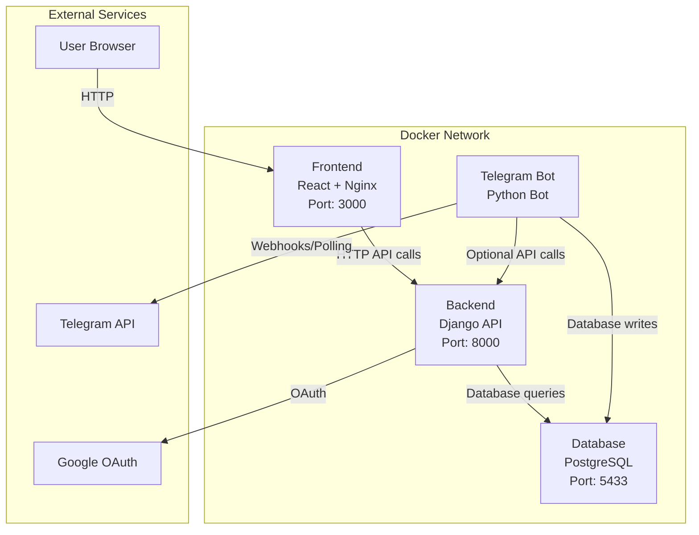

# Schemat połączeń między kontenerami Docker

## Architektura aplikacji

## Szczegółowe połączenia

### Frontend (React + Nginx)
- **Port zewnętrzny**: 3000
- **Połączenia wychodzące**:
  - Backend API: `http://backend:8000` (proxy przez Nginx)
  - Swagger: `http://backend:8000/swagger/`

### Backend (Django API)
- **Port wewnętrzny**: 8000
- **Połączenia wychodzące**:
  - PostgreSQL: `db:5432` (via Django ORM)
  - Google OAuth: `https://accounts.google.com`
  - MailerSend: `https://api.mailersend.com`

### Database (PostgreSQL)
- **Port wewnętrzny**: 5432
- **Port zewnętrzny**: 5433 (dla debugowania)
- **Połączenia przychodzące**:
  - Backend (Django ORM)
  - Telegram Bot (Django ORM)

### Telegram Bot
- **Połączenia wychodzące**:
  - PostgreSQL: `db:5432` (via Django ORM)
  - Telegram API: `https://api.telegram.org`
  - Backend API: `backend:8000` (opcjonalnie)

## Porty zewnętrzne

| Serwis | Port | Opis |
|--------|------|------|
| Frontend | 3000 | Interfejs użytkownika |
| Backend API | 8000 | REST API |
| PostgreSQL | 5433 | Baza danych (debug) |
| PgAdmin | 5050 | Interfejs zarządzania bazą (opcjonalny) |

## Zmienne środowiskowe

### Wspólne dla wszystkich serwisów
- `POSTGRES_USER`, `POSTGRES_PASSWORD`, `POSTGRES_DB`
- `ALLOWED_HOSTS`

### Backend
- `DJANGO_SETTINGS_MODULE`
- `SECRET_KEY`
- `GOOGLE_CLIENT_ID`, `GOOGLE_CLIENT_SECRET`
- `TELEGRAM_BOT_TOKEN`

### Frontend
- `VITE_API_BASE_URL`
- `VITE_GOOGLE_CLIENT_ID`
- `VITE_TELEGRAM_BOT_USERNAME`

## Volumy

- `postgres_data` → `./backend/pg_data` (dane PostgreSQL)
- `./backend` → `/app` (kod backendu dla hot-reload)

## Sieć Docker

Wszystkie kontenery są połączone przez domyślną sieć bridge:
- `betbetter_frontend`
- `betbetter_backend`
- `betbetter_postgres`
- `betbetter_telegram_bot`

Komunikacja między kontenerami odbywa się przez nazwy serwisów jako hostnames.
