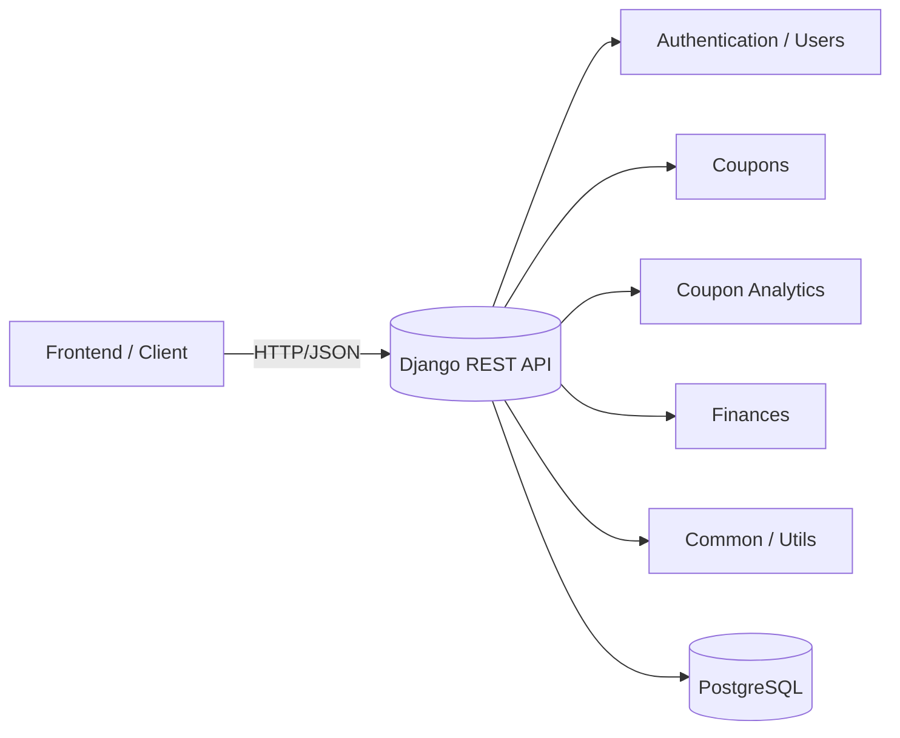
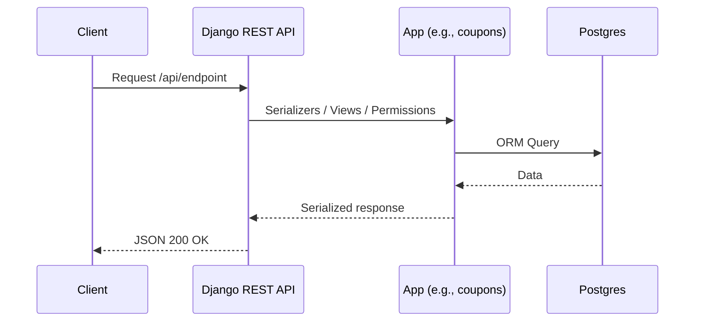

# BetBetter — Backend

A modern API for tracking, analyzing, and visualizing betting coupons. It enables:
- registering and importing coupons (including via OCR),
- performance and statistics analysis,
- budget monitoring,
- alerts when loss limits are exceeded.

---

## Table of Contents
- [Tech Stack](#tech-stack)
- [Quick Start](#quick-start)
  - [Run with Docker Compose (recommended)](#1-run-with-docker-compose-recommended)
  - [Run locally (without Docker)](#2-run-locally-without-docker)
- [API Documentation (OpenAPI / Swagger)](#api-documentation-openapi--swagger)
  - [Authentication in Swagger UI (JWT Bearer)](#authentication-in-swagger-ui-jwt-bearer)
- [Project Structure](#project-structure)
- [Architecture Overview](#architecture-overview)
- [Configuration & Environment](#configuration--environment)
- [Migrations & Data](#migrations--data)
- [Tests](#tests)
- [Code Style & Quality](#code-style--quality)
- [Domain Modules](#domain-modules)
- [Troubleshooting](#troubleshooting)

---

## Tech Stack
- Python • Django • Django REST Framework
- PostgreSQL
- Docker / Docker Compose
- OpenAPI (drf-yasg: Swagger / Redoc)

---

## Quick Start

### 1) Run with Docker Compose (recommended)
```bash
cd backend
docker compose up --build
```
- App: http://localhost:8000
- (Optional) Admin panel: http://localhost:8000/admin

### 2) Run locally (without Docker)
```bash
cd backend
python -m venv .venv
source .venv/bin/activate   # Windows: .venv\Scripts\activate
pip install -r requirements.txt
python manage.py migrate
python manage.py runserver
```

Default port is 8000. If the port is in use, run:
```bash
python manage.py runserver 0.0.0.0:8001
```

---

## API Documentation (OpenAPI / Swagger)
Interactive documentation is available via drf-yasg:
- Swagger UI: `http://localhost:8000/swagger/`
- Redoc: `http://localhost:8000/redoc/`
- OpenAPI (JSON/YAML): `http://localhost:8000/swagger.json` or `http://localhost:8000/swagger.yaml`

> If you use a different integration in the future, check current paths in `BetBetter/urls.py`.

### Authentication in Swagger UI (JWT Bearer)
Most endpoints require authentication (JWT). To execute requests from Swagger UI:
1. Obtain an access token (e.g., `POST /api/users/login/`).
2. In Swagger UI, click “Authorize” and paste your token in the format:
   ```
   Bearer <ACCESS_TOKEN>
   ```
3. Confirm — subsequent requests will include the `Authorization` header.

---

## Project Structure
```text
backend/
├─ BetBetter/            # Project config (settings, urls, asgi/wsgi)
├─ common/               # Shared utilities and components
├─ core/                 # Core, configurations, framework integrations
├─ coupon_analytics/     # Coupon analytics (metrics, reports)
├─ coupons/              # Coupons (CRUD, import, OCR)
├─ finances/             # Budgets, wallets, limits, transactions
├─ users/                # Users, authentication, profiles
├─ manage.py
└─ docker-compose.yml
```

---

## Architecture Overview


### Request Flow (Request → Response)


---

## Configuration & Environment
Common environment variables (adjust to your needs):
- `DJANGO_SECRET_KEY` — Django secret key
- `DJANGO_DEBUG` — `True/False`
- `DJANGO_ALLOWED_HOSTS` — e.g. `localhost,127.0.0.1`
- `DATABASE_URL` or separately: `DB_NAME`, `DB_USER`, `DB_PASSWORD`, `DB_HOST`, `DB_PORT`
- (optional) `DJANGO_CORS_ALLOWED_ORIGINS` for CORS

In Docker Compose, values can be provided via `.env`.

---

## Migrations & Data
- Create/update schema:
  ```bash
  python manage.py makemigrations
  python manage.py migrate
  ```
- (Optional) Create a superuser:
  ```bash
  python manage.py createsuperuser
  ```

---

## Tests
```bash
pytest
# or (depending on your setup)
python manage.py test
```

---

## Code Style & Quality
- Formatting: `black`, `isort`
- Linting: `flake8`, `ruff` (if configured)

Example:
```bash
black .
isort .
flake8 .
```

---

## Domain Modules
- `users` — registration/login, profiles, authentication
- `coupons` — manage and import coupons
- `coupon_analytics` — metrics, stats, reports
- `finances` — budgets, limits, alerts

---

## Troubleshooting
- 500/404 on Swagger/Redoc:
  - verify paths in `BetBetter/urls.py`
  - ensure `drf_yasg` is in `INSTALLED_APPS`
- Database issues:
  - confirm DB container is up (Docker) or verify `DATABASE_URL`
- Migrations:
  - remove local migration files and rebuild them (be careful on production)

---

